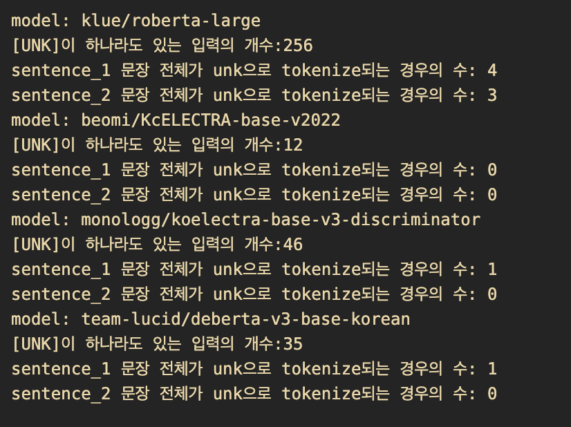

# Level 1. STS project 

 

# 🔎 프로젝트 소개

| **개요** | **설명** |
| --- | --- |
| 주제 | 문장 간 유사도 측정(STS): 두 문장이 의미적으로 얼마나 유사한지를 수치화하는 자연어 처리 태스크  |
| 데이터셋 | 학습 데이터셋: 9,324개, 검증 데이터셋: 550개, 평가 데이터셋: 1,100개   평가 데이터의 50%는 Public 점수 계산에 활용되어 실시간 리더보드에 표기, 남은 50%는 Private 결과 계산에 활용 |
| 평가 | 0과 5사이의 유사도 점수를 예측   피어슨 상관계수(Pearson Correlation Coefficient, PCC) 지표 |
| 개발 환경 | **`GPU`**: Tesla V100 Sever 4대,  **`IDE`**: Vscode, Jupyter Notebook |

 

# 👨🏻‍💻 팀원 소개 및 역할

  
|권유진 |박무재 |박정미 |이용준 |정원식 |
|:-:|:-:|:-:|:-:|:-:|
|</img>|</img>|</img>|</img>|</img>|
|데이터 전처리, 모델 리서치 및 실험, 모델 앙상블|데이터 증강, 손실 함수 실험, 모델 리서치 및 실험|EDA, 데이터 전처리 및 증강, 모델 실험 및 앙상블|프로젝트 구조 구성, 데이터 전처리 및 증강, 모델 구현 및 실험|모델 리서치, 손실 함수 실험, 모델 구현 및 실험, 파인 튜닝|

  

# 📊 탐색적 분석 및 전처리

### 탐색적 분석

- 데이터 분포 및 특성 분석

### 전처리

- 맞춤법: hanspell library를 이용해 맞춤법 검사 진행(~, ^^ 등도 제거), 반복 문자 제거
- 데이터 balancing: Label 값을 0부터 5까지의 정수 단위로 나누었을 때 분포를 살펴본 후, 0을 제외한 단위의 데이터 개수가 약 2000개가 되도록 drop/duplication/swap 진행

  

    
### 데이터 증강 기법

- Swap sentence: 두 문장을 [SEP] 토큰 중심으로 concat하기 때문에 순서를 바꾸는 것만으로도 다른 tokenizer가 생성될 수 있으므로, swap 통해 새로운 데이터 증강
- Duplication: Label 0 데이터의 균형을 맞추는 과정에서 drop한 데이터 일부를 활용하여 sentence_2 위치에 sentence_1을 그대로 사용해 동일한 문장쌍을 만들고 label을 5로 주어 증강
- Adverb insertion, Random insertion: 다음 한국어 사전에서 부사를 검색한 결과로 부사를 교체하거나, BERT based 모델을 활용하여 의미상 자연스러운 토큰을 random으로 삽입하거나 대체하여 증강

### 데이터 버전

| **Data Version** |  | **버전 설명** |
| --- | --- | --- |
| **v1** |  | 데이터 전처리 + Swap Sentence + Duplication |
| **v2** | v2 | v1 + adverb insertion |
|  | v2.1 | v1 + random insertion |
|  | v2.2 | 초창기 전처리 + adverb_insertion |
|  | v2.3 | 초창기 전처리 + random_insertion |
| **v3** | v3 | label_balancing(random seed = 42) |
|  | v3.1 | label_balancing(random seed = 123) |
|  | v3.2 | v3 + adverb insertion |
|  | v3.3 | v3 + random insertion |

 

# ⚒️ 개발

### 프로젝트 구조

  

  

    
- 사용한 모델
    - Roberta
        - klue/roberta-large, klue/roberta-base, klue/roberta-small
    - Electra
        - monologg/koelectra-base-dicriminator, monologg/koelectra-base-v3-dicriminator
        - snulp/KR-ELECTRA-dicriminator
        - beomi/KcELECTRA-base-v2022
    - deberta
        - team-lucid/deberta-v3-base-korean, team-lucid/deberta-v3-xlarge-korean

### Learning Rate Scheduler 구현

- cosine annealing Warmup Restart를 사용하여 초기에는 lr를 빠르게 상승시켜 수렴 속도를 빠르게 하고, epoch이 늘어날수록 lr를 줄여 미세조정 되게끔 하였다.

### Early Stopping 구현

- val_pearson을 기준으로 pearson이 떨어지면 학습을 중단해 과적합을 방지하고자 하였다.

### <person> Token 추가

- 데이터의 익명화를 위해 이름이 <person>으로 치환되어 있는 것을 모델에게 인식시키기 위해 <person> 토큰을 명시적으로 토크나이저에 추가하였다.

### Tokenizer max_length 지정

- tokenizer max_length를 데이터 길이를 명시적으로 지정함으로써 학습 시 메모리 용량을 줄여 큰 모델을 학습할 경우 배치 사이즈 크기를 키워 학습 가능하게 하였다.

### Multi-task Learning

- binary-label을 학습에 활용하고자 model의 아웃풋인 [CLS] 임베딩을 label을 예측하는 regression 모델에 입력하고, 동시에 binary-label을 예측하는 classification 모델에 입력해 두개의 아웃풋에 대해 각각의 loss를 구한 후 더한 최종 Loss를 이용해 전체를 학습하였다. 그 결과 pearson 점수의 상승은 미미했으나 학습 수렴속도는 증가하였다.

  

### 하위 레이어를 활용하여 Fine-tuning

- 하위 레이어를 활용하면 단어 단위의 세부 정보를 통해 유사도 측정에 도움이 될 것이라 생각하고, 각 레이어의 시퀀스 임베딩을 평균해 CNN으로 가중합하여 Head 입력으로 사용하였다. 그 결과 하위 레이어를 이용한 fine-tuning으로 train과 val loss가 감소하면서 소폭 상승을 얻었고, 이미 상세한 정보가 담긴 BERT 인코더 덕분에 큰 상승은 없었지만 하위 정보를 활용해 점수를 조금 상승시킬 수 있었다.

  

# 💥 실험 및 결과

### 모델별 loss graph 및 test pearson

- WandB로 기록된 학습 Loss는 다음과 같다.

  

- 모델별 pearson 점수는 다음과 같다. 상단 두개의 모델은 multi-task learning으로 binary-label에 대한 classification acc도 확인 가능하다.

  

### 모델 별 일부 데이터에 대한 test set 그래프

- 대체로 유사하게 예측되나 예측이 갈리는 것들에 대해서는 앙상블을 통해 결과가 개선될 수 있을 것으로 예상된다.

  

### 모델 성능 및 선정

- 모델 별로 가장 성능이 좋았던 경우의 output을 앙상블에 활용하였다. roberta의 경우 제출 시 점수로 보았을 때 성능이 가장 준수하다고 판단하여 loss가 다른 두 버전을 활용하였다.
    
    | **모델명** | **Batch_size** | **Learning Rate** | **Epoch** | **Data version** | **Test Score** | **Model** | **Loss** |
    | --- | --- | --- | --- | --- | --- | --- | --- |
    | team-lucid/deberta-v3-xlarge-korean_2 | 16 | 2e-5 | 5 | v3.1 | 0.96516 | deberta | MSE |
    | beomi/KcELECTRA-base-v2022_1		 | 128 | 5e-5 | 30 | v3.3 | 0.9348 | kr-electra | MSE |
    | team-lucid/deberta-v3-base-korean_1 | 64 | 2e-5 | 20 | v1 | 0.9309 | deberta | MSE |
    | Roberta-large_11 | 16 | 5e-6 | 20 | v1 | 0.9291 | roberta | L1Loss |
    | Roberta-large_12 | 64 | 5e-6 | 20 | v1 | 0.9286 | roberta | MSE |
    | snunlp-KR-ELECTRA-discriminator_w. Multi-task_9 | 32 | 2e-5 | 20 | v2.1 | 0.92785 | kr-electra | MSE |
- 앙상블의 경우 구현하기 쉬운 모든 output.csv을 평균을 구하는 방식과, output.csv를 데이터로 활용하는 스태킹 방식을 시도하였다. 최종 결과는 아래와 같으며, 같은 평가 점수를 받았다.
    - 평가 데이터 일부에 대한 점수는 0.9284로 1등이 0.94인 비해 낮은 편이었으나, 중간 점수에 과적합 시키거나 과도한 앙상블을 하지 않았기에 최종 점수가 높아진 것으로 보인다.

  

        
### 결과

- 리더보드 [중간 순위]

  

    
- 리더보드 [최종 순위]

  

